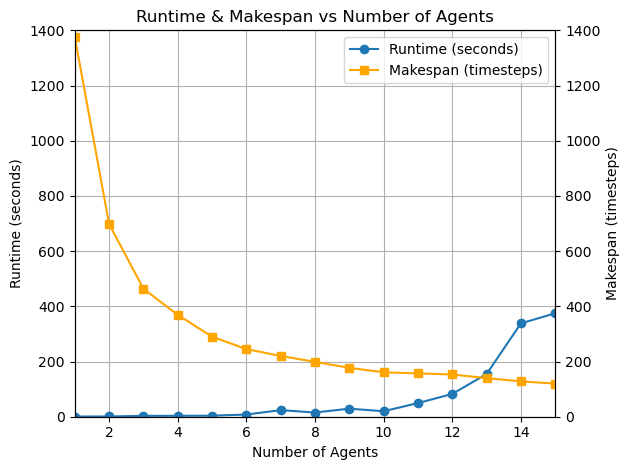
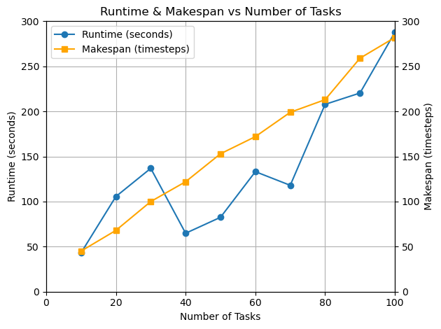

# Multi-Agent Pickup and Delivery Solver

A multi-agent pickup and delivery (MAPD) solver implementing windowed priority based search algorithm, hungarian matching, and FIFO pick-up constraints for warehouse automation scenarios.

## Overview

This project provides a multi-agent pathfinding (MAPF) solution for coordinating multiple Autonomous Guided Vehicles (AGVs) in warehouse environments, handling AGV orientation and kinematic costs, task assignments, collision-avoidance, and FIFO order task pick-up constraints.  

This project is completed as a submission to the [2025 Siemens Xcelerator Contest - MioVerse Track](https://www.siemens-x.com.cn/event-detail?eventId=700bf02d-da5c-46c6-ab18-374dc82438e6).

## Features

- **Collision-Free Path Planning**: Implements Priority-Based Search (PBS) with windowed planning horizon
- **Conflict Resolution**: Conflict detection and resolution between agents
- **Windowed Collision Resolution**: Implements Rolling-Horizon Collision Resolution (RHCR) to increase computation efficiency
- **Orientation-Aware Pathfinding**: Considers orientation and turning actions of agents during pathfinding
- **FIFO Constraint Handling**: Maintains First-In-First-Out order by using a reservation system for task pick-up at each location
- **Hungarian Task Assignment**: Efficient allocation of pickup and delivery tasks to multiple AGVs
- **AGV Trajectory Visualization**: Animated visualization of AGV movements and task execution

## Scenario Details

This is the sample scenario provided by the competition. Specifics and rules can be changed depending on different use cases.

### Environment

| Aspect                    | Description                                                                                                                                                                                                                                  |
| ------------------------- | -------------------------------------------------------------------------------------------------------------------------------------------------------------------------------------------------------------------------------------------- |
| Warehouse dimensions      | A grid of 20 (X) × 20 (Y) cells. Coordinates: (1,1) bottom-left; (20,20) top-right. Movement only along grid centers; no diagonals.  |
| Loading Ramps             | Located on warehouse walls. Each has one pick-up point: the adjacent interior cell (e.g., ramp at (1,6) → pick-up at (2,6)). Parcels arrive here and form a stack, and parcels can only be picked up in FIFO order (eg. earlier rows in task input file for a given start-point must be picked up first).  |
| Offload Ramps             | Labeled by destination city (e.g., Beijing, Shenzhen, etc.). A parcel can be dropped off on any of the four orthogonally adjacent cells (above, below, left, right) to its designated offload ramp cell. AGVs are free to choose whichever of the four is reachable or least congested.       |
| AGV orientation | The orientation of each AGV must be considered during path planning. 0 degrees faces the east, 90 degrees faces the north, 180 degrees faces the west, and 270 degrees faces the south.    |
| Obstacles         | AGVs must remain within the 20x20 warehouse, and the loading/offload ramps are treated as obstacles (eg. AGVs cannot drive "through" the ramps).      |

### AGVs

| Attribute          | Specification                                                                                       |
| ------------------ | --------------------------------------------------------------------------------------------------- |
| Size               | Occupies exactly 1 grid cell.                                                                       |
| Movement           | AGVs can move forward in the direction they face at 1 cell per timestep (no need to model acceleration/deceleration).    |
| Turning            | AGVs cannot move to another cell when turning; a turn (90°, 180°, or 270°) takes 1 timestep.        |
| Orientation Angles | 0° = +X, 90° = +Y, 180° = −X, 270° = −Y. Initial coordinates and orientations for each AGV are given. |
| Carrying Capacity  | 1 parcel at a time.                                                                                 |
| Waiting            | AGVs may wait in place for any integer number of timesteps.                                         |
| Loading/Unloading  | AGVs must be stationary during pick-up or drop-off (no turning or moving). Pick-up or drop-off takes 1 timestep each.  |
| Collisions         | Collisions must be strictly avoided during the path planning phase. A collision occurs if (a) two or more AGVs occupy the same cell at the same time, or (b) two AGVs simultaneously swap cells.       |

## Project Structure

```
multi-agent-pickup-delivery-solver/
├── README.md                # This file
├── Report.pdf               # Detailed technical report
├── solver.py                # Main solver implementation
├── visualizer.py            # Visualization tool for trajectories
├── input/
│   ├── map_data.csv         # Warehouse layout and AGV configuration
│   └── task_csv.csv         # Task definitions (pickup/delivery requests)
├── output/
│   ├── agv_trajectory.csv   # Generated AGV trajectories
│   └── agv_simulation.mp4   # Animated visualization of solution
└── performance_testing/
    ├── runtime_makespan_vs_agents.png    # Performance analysis graph
    ├── runtime_makespan_vs_tasks.png     # Performance analysis graph
    ├── plot.ipynb                        # Jupyter notebook for performance analysis
    ├── map_data_*.csv                    # Test configurations where * is the number of agents (AGVs)
    └── task_csv_*.csv                    # Test configurations where * is the number of tasks
```

## Installation

### Prerequisites

For main MAPD solver support:
```bash
# No external libraries needed (tested working on Python 3.10)
```

For visualization video generation support:
```bash
# Python 3.7+ required
pip install pandas matplotlib numpy

# Install FFmpeg (required for MP4 export)
# macOS
brew install ffmpeg

# Ubuntu/Debian
sudo apt-get install ffmpeg

# Windows
# Download from https://ffmpeg.org/download.html
```

## Usage

### Running the Solver

```bash
python solver.py
```

The solver will:
1. Read warehouse configuration from `input/map_data.csv`
2. Load tasks from `input/task_csv.csv`
3. Generate optimal AGV trajectories
4. Output results to `output/agv_trajectory.csv`

### Visualizing Results

```bash
python visualizer.py
```

This will:
1. Load the generated trajectories
2. Create an animated visualization
3. Save the animation as `output/agv_simulation.mp4`

## Input Format

### map_data.csv
Defines the warehouse layout and initial AGV positions:
- Start points (pickup locations)
- End points (delivery locations)
- AGV initial positions and orientations

### task_csv.csv
Specifies pickup and delivery tasks:
- Task ID
- Pickup location
- Delivery location
- Priority level (Normal or Urgent)
- Time constraints
    - This is the maximum timestep from initialization that the parcel has to be delivered on.

## Output Format

### agv_trajectory.csv
Contains timestamped AGV status:
- Timestamp
- AGV name
- Position and orientation
- Loaded status
- Task-ID

## Configuration

Key parameters in `solver.py`:

```python
WINDOW_SIZE = 30     # collisions need to be resolved only within this window of future timesteps
REPLAN_PERIOD = 15   # Replanning frequency (the number of timesteps between each periodic path replan)
```

## Performance

The computation time can be adjusted based on the tradeoff between makespan (the number of timesteps it takes for all tasks to be completed) and computational efficiency.

Adjusting the window size and replan period will affect this tradeoff:
* Window size:
    * Larger value leads to more stable paths (and possibly better makespan)
    * Smaller value leads to less computation overhead and thus better computation efficiency
* Replan period:
    * Larger value leads to less periodic replans and thus better computation efficiency
    * Smaller value leads to more stable paths

Based on testing with a MacBook (M3 Pro) using sample input files (20x20 warehouse, 100 tasks, 12 AGVs):

| WINDOW_SIZE      |REPLAN_PERIOD     | Runtime (seconds)| Makespan (timesteps)|
|------------------|------------------|------------------|---------------------|
|30                |15                |560.45            |270                  |
|30                |10                |572.02            |270                  |
|20                |10                |570.99            |301                  |
|15                |10                |491.24            |294                  |
|10                |5                 |287.69            |289                  |
|5                 |3                 |221.95            |279                  |

### Performance Analysis

The solver's performance has been thoroughly analyzed across different scenarios:



This graph shows how the solver scales with varying numbers of agents (AGVs) while keeping the number of tasks constant at 50 (with window_size=10 and replan_period=5). The makespan continuously decreases as expected because more agents are available to complete tasks. The runtime also remains reasonable even as warehouse becomes congested from too many agents.

<br><br>



This graph illustrates solver performance with varying task counts while keeping the number of agents constant at 12 (with window_size=10 and replan_period=5). The runtime and makespan scales near linearly which means that the algorithm can be predictably scaled to larger workloads.


## References

1. Hönig, Wolfgang, et al. "Conflict-based search with optimal task assignment." *Proceedings of the International Joint Conference on Autonomous Agents and Multiagent Systems*. 2018. [dl.acm.org/doi/pdf/10.5555/3237383.3237495](https://dl.acm.org/doi/pdf/10.5555/3237383.3237495)
2. Li, Jiaoyang, et al. "Lifelong multi-agent path finding in large-scale warehouses." *Proceedings of the AAAI Conference on Artificial Intelligence*. Vol. 35. No. 13. 2021. [arxiv.org/pdf/2005.07371](https://arxiv.org/pdf/2005.07371)
3. Liu, Minghua, et al. "Task and path planning for multi-agent pickup and delivery." *Proceedings of the International Joint Conference on Autonomous Agents and Multiagent Systems (AAMAS)*. 2019. [dl.acm.org/doi/pdf/10.5555/3306127.3331816](https://dl.acm.org/doi/pdf/10.5555/3306127.3331816)
4. Ma, Hang, et al. "Lifelong multi-agent path finding for online pickup and delivery tasks." *arXiv preprint arXiv:1705.10868* (2017). [arxiv.org/pdf/1705.10868](https://arxiv.org/pdf/1705.10868)
5. Xu, Qinghong, et al. "Multi-goal multi-agent pickup and delivery." *2022 IEEE/RSJ International Conference on Intelligent Robots and Systems (IROS)*. IEEE, 2022. [arxiv.org/pdf/2208.01223](https://arxiv.org/pdf/2208.01223)
